# The Dark Knight

### WRO Future Engineers 2026 — Engineering Documentation

**Team:** Currents

---

## Table of Contents

1. [Team](#1-team)
2. [Robot Overview](#2-robot-overview)
3. [Robot Specifications](#3-robot-specifications)
4. [Components](#4-components)
5. [3D Modelling and Mechanical Design](#5-3d-modelling-and-mechanical-design)
6. [Mobility Management](#6-mobility-management)
7. [Power and Electronics](#7-power-and-electronics)
8. [Software Architecture](#8-software-architecture)
9. [Open Challenge](#9-open-challenge)
10. [Obstacle Challenge](#10-obstacle-challenge)
11. [Camera Placement](#11-camera-placement)
12. [Failure Cases](#12-failure-cases)
13. [Future Enhancements](#13-future-enhancements)
14. [Repository Structure](#14-repository-structure)

---

# 1. Team

| Name | Role |
|---|---|
| **Darsh Makadia** | Programming & Electronics |
| **Ehan Mansuri** | Mechanical Design & 3D Modelling |
| **Sunil Solanki** | Coach |

**Robot:** The Dark Knight  
**Team:** Currents  
**Competition:** WRO Future Engineers 2026

---

# 2. Robot Overview

The Dark Knight is a four-wheeled autonomous robot built for the WRO Future Engineers category.

The main computer is a **Raspberry Pi 5 (4 GB)**. A Raspberry Pi Camera is used for detecting the track walls, colours and obstacles. A servo controls the front steering mechanism, while a geared DC motor drives the rear axle.

The robot uses a LEGO Technic drivetrain with a differential. The chassis and several other parts were designed in CAD and 3D printed in PLA.

During development, we changed both the mechanical design and the software several times. These changes were based on problems and performance observations from testing the robot, including drivetrain speed, steering behaviour, wall detection, camera placement, obstacle detection and lighting conditions.

## Robot Photos

All robot photographs are stored in [`v-photos/`](v-photos/).

### Front View

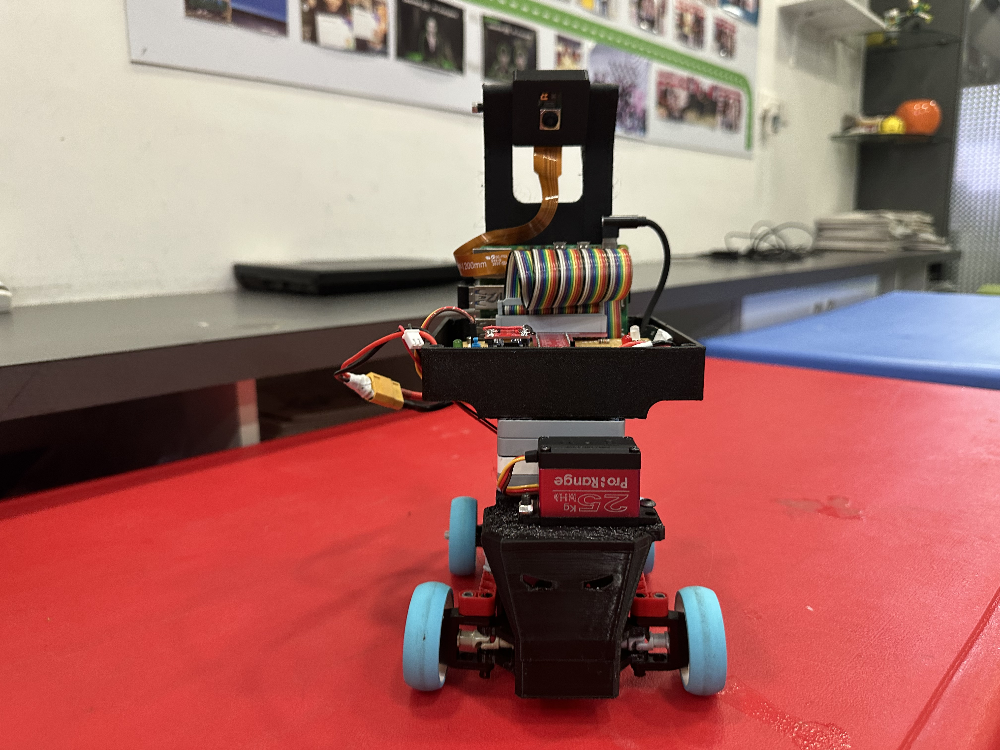

### Back View

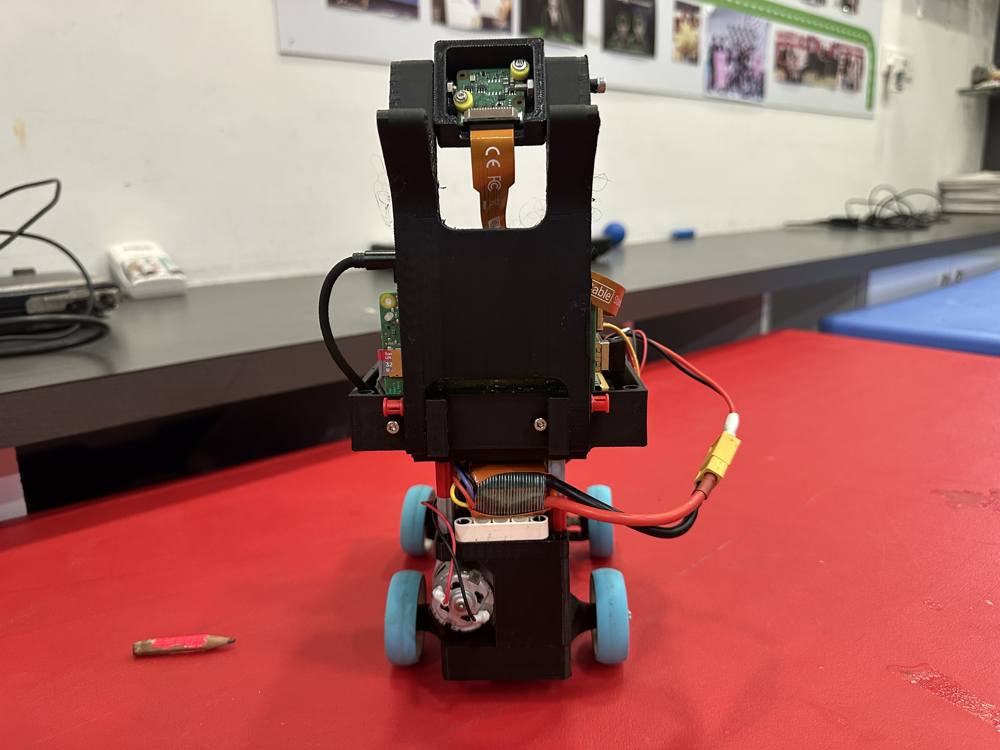

### Side Views

  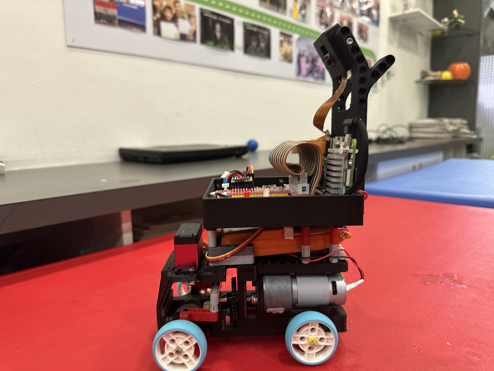
  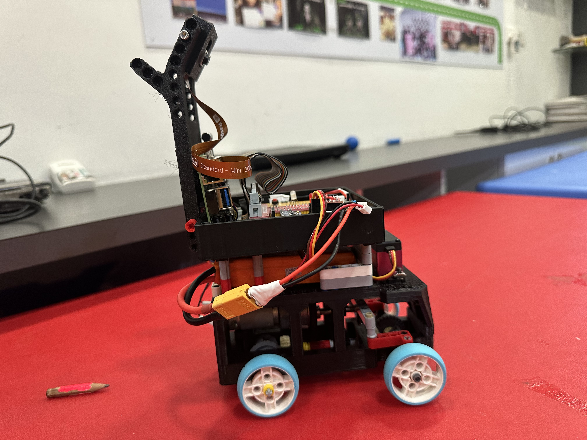

### Motor and Steering

  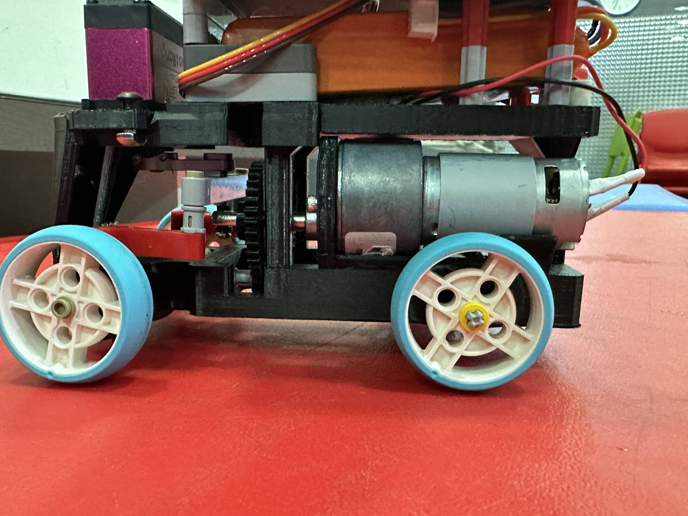
  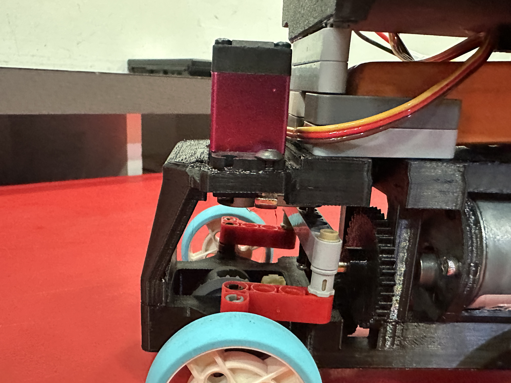

### Differential and Electronics

  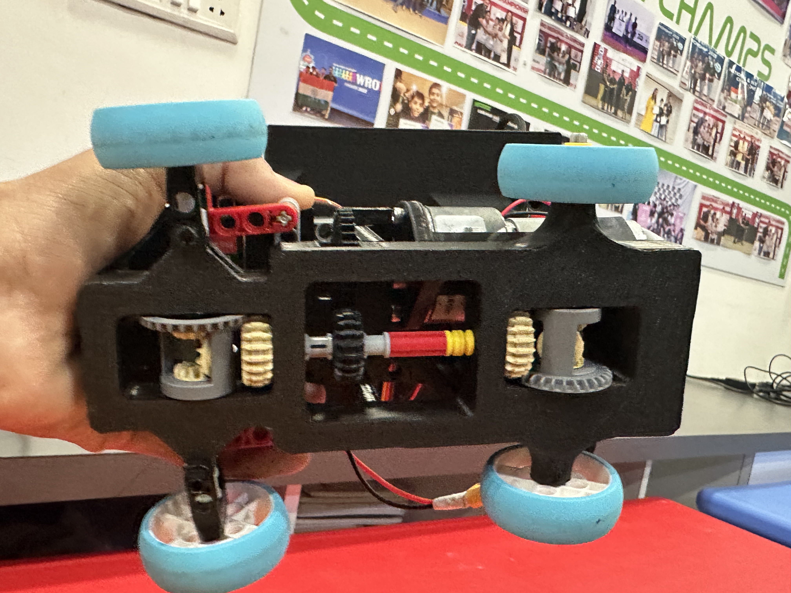
  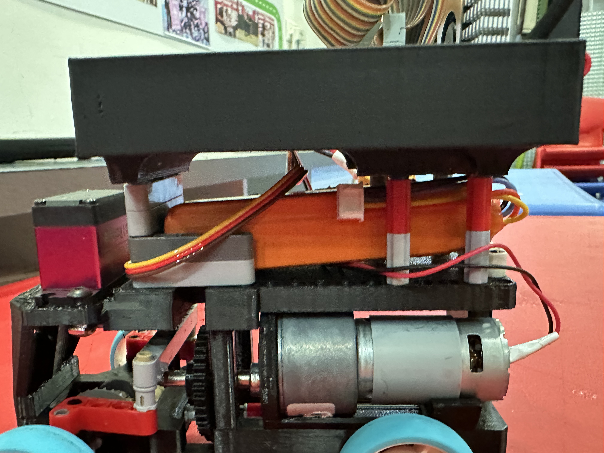

---

# 3. Robot Specifications

| Specification | Value |
|---|---:|
| **Length** | 23 cm |
| **Width** | 13 cm |
| **Height** | 27 cm |
| **Mass** | 863 g |
| **Weight distribution** | Approximately centred |
| **Wheel diameter** | 43.2 mm |
| **Drive gear ratio** | 1.8 : 1 |

The weight distribution is approximately centred. This helped keep the robot stable during turns and while carrying the camera and electronics.

## Motor and Torque

The drivetrain was developed by considering the balance between available torque and robot speed.

The initial drivetrain configuration provided more torque than was necessary for the robot's mass and operating conditions. Since the WRO Future Engineers track requires the robot to travel quickly, we decided to trade some available torque for higher wheel speed.

### Initial Drivetrain Configuration

- **Stall torque:** 0.60 kg
- **Rated torque:** 0.15 kg

### Final Drivetrain Configuration

After changing the gear ratio to the final configuration:

- **Stall torque:** 0.33 kg
- **Rated torque:** 0.083 kg

The reduction in available torque was acceptable because the robot did not require the higher torque capacity of the original configuration. The priority was to make better use of the 600 RPM motor's available speed.

The final drivetrain was therefore selected as a speed-oriented configuration while retaining sufficient torque for the robot's required movement.

### Engineering Trade-off

| Configuration | Stall Torque | Rated Torque | Development Focus |
|---|---:|---:|---|
| Initial | 0.60 kg | 0.15 kg | Higher torque capacity |
| Final | 0.33 kg | 0.083 kg | Higher speed |

The final configuration was validated through physical testing. The robot travelled **3 metres in 2.25 seconds**, giving a measured speed of approximately **1.33 m/s (4.8 km/h)**.

This showed that the final drivetrain provided sufficient performance for the robot while prioritising the speed required for the WRO track.

---

# 4. Components

## Electronics and Electromechanical Components

| Component | Use |
|---|---|
| **Raspberry Pi 5 (4 GB)** | Main computer and control unit |
| **Raspberry Pi Camera Module** | Camera input |
| **TB6612FNG Dual Motor Driver** | Controls the drive motor |
| **JGB37-520 DC Motor (12 V, 600 RPM)** | Drive motor |
| **Johnson Gear Motor (1000 RPM)** | Used during an earlier prototype |
| **High-Torque Digital Servo** | Front steering |
| **3S LiPo Battery, 2200 mAh** | Main power source |
| **5 V Buck Converter** | Regulated power |
| **USB Buck Converter** | Secondary 5 V supply |
| **OLED Display** | Status display |
| **IMU** | Orientation sensing |
| **RGB LED** | Status indication |
| **Programmable LED** | Digital status output |
| **Push Button** | Start/user input |
| **PLA Filament** | 3D-printed parts |

## LEGO Technic Components

The drivetrain and steering mechanism use:

- 2×4 L Beam
- 3×3 T Shape
- 13×1 Beam
- Bush
- ½ Bush
- 2L Axle Connector
- Toggle Double with Axles & Pins
- 3×3 L-Shaped Connector with 4 Pins
- 3L H-Shaped Connector with 4 Pins
- 28-Tooth Differential
- 24-Tooth Gear
- 20-Tooth Gear
- 12-Tooth Bevel Gear
- 3L Friction Pin
- Smooth Pin
- Friction Pin
- 15×1 Beam
- 7×1 Beam
- Smooth Pin and Axle
- 1×9 Bent Beam (6-4)
- Universal Joint
- 3×1 Beam
- 2L Pin Connector
- ¾-Pin Smooth
- ½-Pin Smooth
- 43.2 mm Technic Wheel
- 30 mm Offset Tire
- 9 Beam
- 5L Axle
- 6L Axle
- 4L Axle with Stop

---

# 5. 3D Modelling and Mechanical Design

We designed the main custom parts of the robot using **3D CAD** and printed them in PLA.

3D printing made it easier to change the design during development. If a part did not fit properly or needed to be changed, we could modify the CAD model and print a new version.

The main design goals were:

- Keep the robot compact
- Keep the weight distribution close to the centre
- Provide mounting points for the electronics
- Protect the electronics
- Keep the camera stable
- Keep wires away from moving parts
- Make parts accessible during testing
- Integrate the LEGO Technic drivetrain with the printed chassis

## CAD Models

The CAD models are stored in [`models/`](models/).

The folder contains five main models:

- Chassis
- Circuit box
- Circuit box lid
- Camera mount
- Camera case

### Chassis

The chassis is the main structural part of the robot. It holds the drivetrain, motors, steering mechanism and upper section.

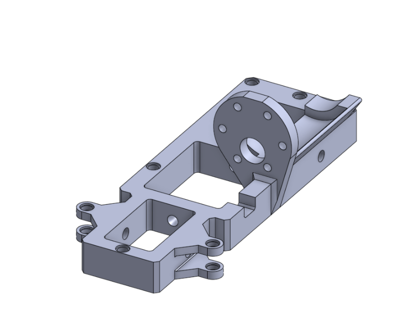

### Circuit Box

The circuit box holds and protects the electronics.

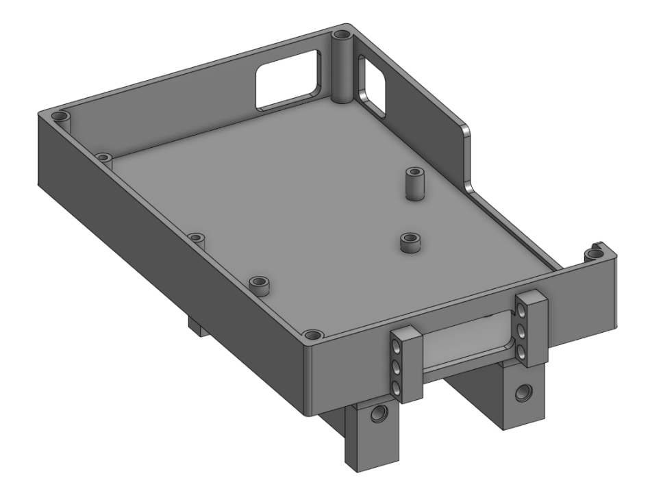

### Circuit Box Lid

The lid can be removed to access the electronics during testing and maintenance.

### Camera Mount

The camera mount holds the Raspberry Pi Camera in the required position.

### Camera Case

The camera case holds and protects the camera board.

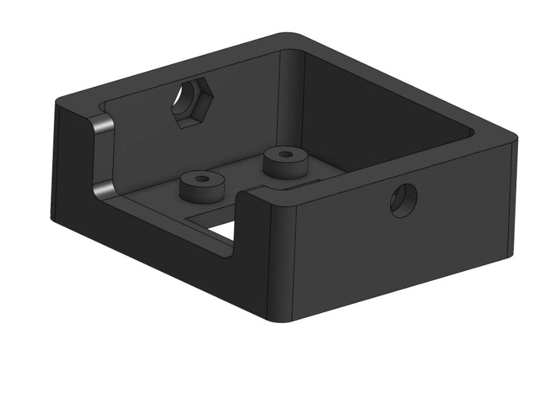

---

# 6. Mobility Management

## Drivetrain

The robot uses **rear-wheel drive**.

A single geared DC motor drives the rear axle through a LEGO Technic gear train and a **28-tooth differential**.

The differential allows the two rear wheels to rotate at different speeds while turning.

The drivetrain uses a combination of spur and bevel gears to transfer power from the motor to the rear axle.

The final gear ratio is:

**1.8 : 1**

The gear ratio was selected to prioritise robot speed rather than maximum available torque. During development, we found that the original torque capacity was more than required for the robot's mass and operating conditions.

We therefore changed the gear ratio to make better use of the 600 RPM motor's available speed. This reduced the documented drivetrain torque from 0.60 kg stall / 0.15 kg rated to 0.33 kg stall / 0.083 kg rated.

The reduction in torque was acceptable because the robot still had sufficient drive performance for the track. The final configuration was validated through a 3 m speed test, where the robot completed the distance in 2.25 seconds.

## Steering

The front wheels are controlled using a high-torque digital servo connected to the steering mechanism through LEGO Technic linkages.

The servo is controlled using a **50 Hz PWM signal** from the Raspberry Pi.

We calibrated the steering limits on the physical robot:

| Setting | Value | Meaning |
|---|---:|---|
| `CENTER` | 95–98 | Approximately straight |
| `LEFT` | 70 | Maximum calibrated left turn |
| `RIGHT` | 125–130 | Maximum calibrated right turn |

The limits were added after the servo was found to occasionally overturn during testing. The software limits prevent it from pushing the steering mechanism too far.

## Wheels

The robot uses **43.2 mm diameter wheels**.

The wheel size was chosen as a compromise between speed, torque, ground clearance and stability.

## Drivetrain Testing

The final drivetrain was tested on the physical robot to verify that the speed-oriented gear ratio still provided sufficient drive performance.

### Speed Test

| Parameter | Result |
|---|---:|
| Test distance | 3 m |
| Test time | 2.25 s |
| Measured speed | 1.33 m/s |
| Equivalent speed | 4.8 km/h |

The robot was also tested over 10 runs:

- **Successful runs:** 8
- **Failed runs:** 2
- **Overall success rate:** 80%

The main causes of failure were related to vision detection and lighting conditions rather than insufficient drivetrain torque.

This testing helped confirm that reducing the available drivetrain torque was acceptable for the final robot because the robot achieved the required movement speed while maintaining sufficient drive performance.

---

# 7. Power and Electronics

## Power Distribution

| Rail | Source | Used For |
|---|---|---|
| **Raw battery voltage** | 3S LiPo | Motor driver and buck converters |
| **+5 V** | Buck converter | Servo and electronics |
| **+3.3 V** | Raspberry Pi 5 | OLED and IMU |
| **GND** | Battery negative | Common ground |

## Raspberry Pi 5 Pin Connections

| Pi Pin | GPIO | Function | Connected To |
|---|---|---|---|
| Pin 1 | — | 3.3 V | OLED, IMU |
| Pin 3 | GPIO2 / SDA | I2C Data | OLED SDA, IMU SDA |
| Pin 5 | GPIO3 / SCL | I2C Clock | OLED SCL, IMU SCL |
| Pin 12 | GPIO18 | Digital Input | Push Button |
| Pin 15 | GPIO22 | PWM | Servo |
| Pin 16 | GPIO23 | Digital Output | RGB LED Green |
| Pin 18 | GPIO24 | Digital Output | RGB LED Blue / Motor Driver |
| Pin 22 | GPIO25 | Digital Output | RGB LED Red / Motor Driver |
| Pin 31 | GPIO6 | Digital Output | Motor Driver `nSTBY` |
| Pin 32 | GPIO12 / PWM0 | Digital Output | Programmable LED |
| Pin 33 | GPIO13 / PWM1 | PWM | Motor Driver |
| Pins 34, 39 | — | Ground | Common Ground |

## TB6612FNG Motor Driver

| Pin | Connection | Function |
|---|---|---|
| `VMOT` | Raw battery voltage | Motor power |
| `VCC` | +5 V | Logic power |
| `GND` | Common ground | Ground |
| `AO1 / BO2` | Motor + | Motor output |
| `AO2 / BO1` | Motor − | Motor output |
| `PWMA / PWMB` | GPIO13 | Speed control |
| `AIN2 / BIN2` | GPIO24 | Direction control |
| `AIN1 / BIN1` | GPIO22 | Direction control |
| `nSTBY` | GPIO6 / +5 V | Driver enable |

The two channels of the TB6612FNG are connected in parallel to provide enough current for the drive motor.

## Sensors and Peripherals

| Component | Connection |
|---|---|
| OLED | 3.3 V, GND, SDA, SCL |
| IMU | 3.3 V, GND, SDA, SCL |
| Servo | GND, +5 V, GPIO22 |
| Push Button | +5 V / GPIO18 |
| RGB LED | GPIO23, GPIO24, GPIO25 |
| Programmable LED | GPIO12 |

## Circuit From Top

This photo shows the electronics and wiring from the top of the robot.

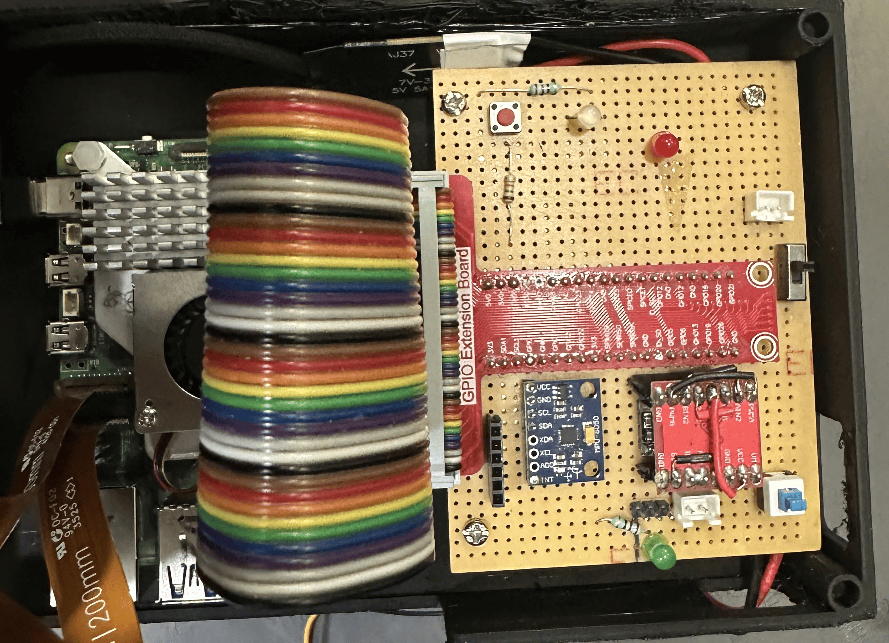

## Circuit Schematic

The complete circuit schematic showing the Raspberry Pi, motor driver, power system, sensors and other electronics is shown below.

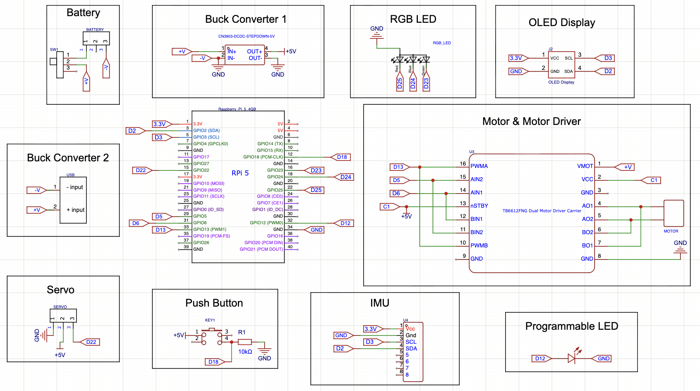

# 8. Software Architecture

The software runs on the Raspberry Pi 5 using Python.

The main parts of the software are:

- Camera input
- Image processing
- Wall detection
- Colour detection
- Direction detection
- Steering control
- Line and corner counting
- Obstacle detection
- Gyro-based turning
- Motor control

The software was developed by testing different approaches on the physical robot. When something was not reliable enough, we changed the approach and tested it again.

## Camera Processing

### 1. Frame Capture

The camera captures frames at `1920 × 680`.

### 2. Exposure

At startup, automatic exposure and white balance are allowed to run for approximately two seconds.

The resulting settings are then locked.

This prevents the camera from changing its exposure during the run and affecting colour detection.

### 3. Pre-processing

Each frame is:

1. Gaussian blurred
2. Converted to LAB colour space
3. Processed using CLAHE on the lightness channel
4. Combined again with the A/B channels

### 4. Colour Masks

`cv2.inRange()` is used to detect the required colours.

The masks are then processed using morphological operations before contours are extracted.

---

# 9. Open Challenge

## Initial Navigation

At the start of the run, the robot begins line detection and travels at a slower speed while looking for the first colour marker.

The first colour detected is used to determine the direction of the track.

Our first steering approach was to keep the robot in the centre between the two black walls.

The centre was calculated approximately as `centre = (left_wall + right_wall) / 2`.

The robot then used this centre position to calculate its steering correction.

However, this did not give reliable results.

If one wall was not detected properly, the calculated centre could change significantly, which caused incorrect steering.

## Wall-Following Logic

We changed the navigation system to follow one wall depending on the direction.

### Clockwise

The robot follows the **right wall**.

### Anticlockwise

The robot follows the **left wall**.

This was more reliable because the robot no longer needed both walls to be detected at the same time.

## Meander Turns

During testing, the robot sometimes made unstable turns.

We changed the steering behaviour to make more controlled meander turns instead of making large corrections whenever the detected wall position changed.

## Line and Corner Counting

We keep a cooldown time after detecting a line or corner.

Without the cooldown, the same line could be detected multiple times while it was still visible to the camera.

The line counter therefore works together with the cooldown.

The robot counts **12 corners** during the run.

When the **13th corner** is detected, the robot stops.

## Open Challenge Target

The drivetrain and software were developed around the goal of completing the Open Challenge in approximately **25 seconds**.

The final gearing was selected as a speed-oriented compromise. Testing showed that the remaining available torque was sufficient for the robot's required movements while providing the higher speed needed for the track.

---

# 10. Obstacle Challenge

The obstacle challenge required additional logic because the robot starts from the parking area and does not initially have both walls visible.

## Starting Direction

When starting from parking:

- If the robot is travelling anticlockwise, it may not initially see the left wall.
- If the robot is travelling clockwise, it may not initially see the right wall.

The visible wall can therefore be used to determine the direction:

**Right wall → Clockwise**

**Left wall → Anticlockwise**

## Gyro-Based Starting Turn

A gyro-based turn is used to get the robot out of the parking position and onto the main track.

The gyro measures the robot's rotation so that the turn is not based only on a fixed movement time.

## Initial Obstacle Logic

Our first obstacle logic was:

- **Green obstacle → Turn left**
- **Red obstacle → Turn right**

This worked in simpler situations, but we had a problem when an obstacle was positioned near a corner.

The robot could turn too early and get stuck around the obstacle.

## Improved Obstacle Logic

We changed the system so that the robot does not immediately make a fixed turn when an obstacle appears.

When an obstacle is detected, the robot first tries to bring the obstacle towards the centre of its body.

Once the obstacle satisfies the minimum distance condition, the robot decides how to move around it.

The process is:

**Detect obstacle → Move obstacle towards robot centre → Check minimum distance → Choose movement direction → Avoid obstacle**

This worked better around corner obstacles.

## Normal Navigation

If no obstacle is detected, the robot uses the same wall-following logic as the Open Challenge.

**Obstacle detected → Obstacle avoidance**

**No obstacle → Normal wall following**

Once the required laps are completed, the robot exits the navigation loop.

---

# 11. Camera Placement

Camera placement was one of the parts of the robot that we changed several times during testing.

## Why the Camera is at the Back

We kept the camera towards the **backside of the robot**.

The reason was mainly related to obstacle detection.

When the robot reaches an obstacle and moves ahead of it, a forward-facing camera can lose sight of the obstacle.

If the obstacle disappears from the camera too early, the robot may make another steering decision. This can cause it to steer back towards the obstacle and potentially knock it over.

Keeping the camera towards the back allows the obstacle to remain visible for longer while the robot moves past it.

## Camera Height

We initially kept the camera lower.

The lower position allowed the robot to make judgements faster because the relevant part of the track was closer to the camera.

We then adjusted the position based on the wall and obstacle detection results.

## Camera Angle

We tested multiple camera angles.

At some of the earlier angles, wall detection became unstable around corners.

At one point, an incorrect camera angle caused the robot to move in the wrong direction.

Because of this, the final camera position was chosen through physical testing rather than only from the CAD model.

---

# 12. Failure Cases

A lot of the development involved dealing with hardware failures and unexpected behaviour.

## Battery Failure

The battery exploded while it was being charged.

This was one of the major hardware failures during development and made us more careful about LiPo charging and handling.

## USB Buck Converter

The original USB buck converter was rated at `5 V / 3 A`.

The Raspberry Pi was not getting enough current from it.

We changed the converter because the Raspberry Pi requires a higher current supply under load.

## Motor Stalling

Stalling occurs when you prevent the motor from moving even though the power is still on.

This can cause the motor to draw more current than the motor driver can provide.

This can lead to the motor driver overheating, getting damaged or stopping completely.

We therefore had to take motor stalling into account during testing.

## Servo Overturning

The steering servo sometimes overturned for reasons we were not able to identify.

To prevent this from damaging the steering mechanism, we added software safety limits.

The calibrated limits are:

- `LEFT = 70`
- `CENTER = 95–98`
- `RIGHT = 125–130`

The servo cannot move outside these calibrated values.

---

# 13. Future Enhancements

The main feature we still plan to add is automated parking.

The planned sequence after completing the three laps is:

1. Complete three laps
2. Move to the corner section
3. Perform a U-turn
4. Follow the outer wall
5. Detect the magnets
6. Stop at a fixed position
7. Perform a gyro-based turn

The aim is to make the final parking position consistent rather than relying only on timed movement.

---

# 14. Repository Structure

The repository is organised into the robot's source code, photographs and CAD models.

- `src/` — Robot software
- `v-photos/` — Robot photographs and videos
- `models/` — 3D models of the custom parts

The `models/` folder contains:

- `chassis`
- `circuit_box`
- `circuit_box_lid`
- `camera_mount`
- `camera_case`

---

## Conclusion

The Dark Knight was developed through repeated testing of both the hardware and software.

Our first wall-following approach used the centre between the two black walls, but it was not reliable enough. We changed this to direction-based wall following, where the robot follows the right wall when going clockwise and the left wall when going anticlockwise.

We also changed the camera position and angle after finding problems with wall detection and obstacle detection. The obstacle logic was changed after the robot got stuck near a corner obstacle.

On the hardware side, we changed the USB buck converter after the Raspberry Pi was not receiving enough current, added steering safety limits after the servo overturned, and took motor stalling into account when testing the drivetrain.

The final robot combines a Raspberry Pi 5, camera-based vision, LEGO Technic drivetrain components, 3D-printed parts, servo steering, a differential drive, gyro-based turning and colour-based detection.
