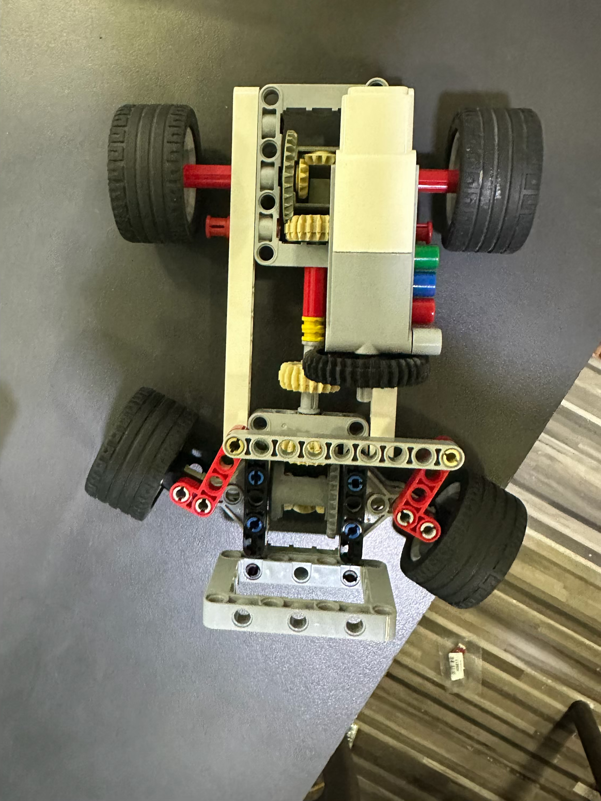
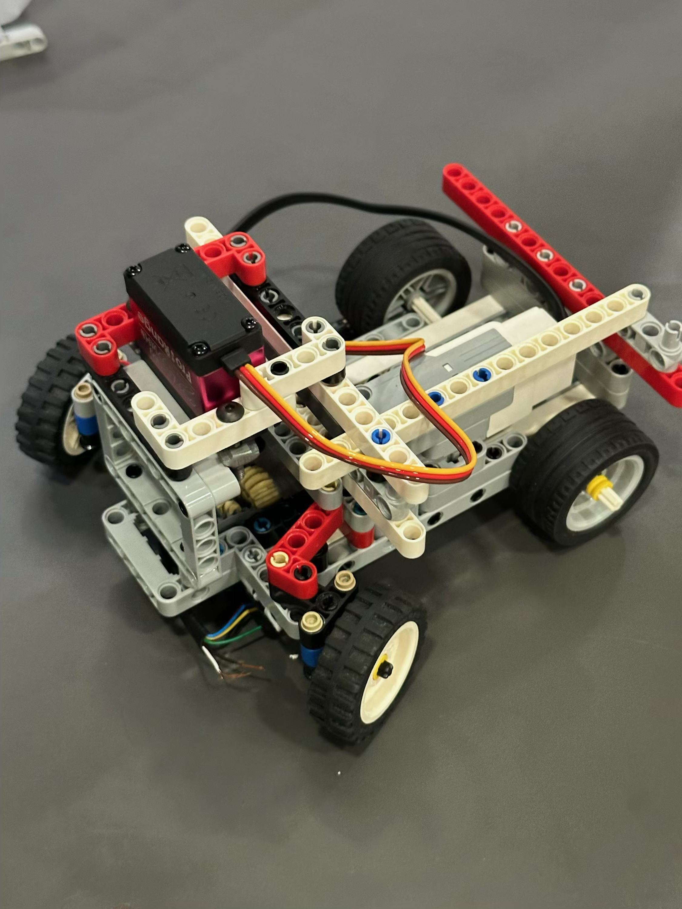
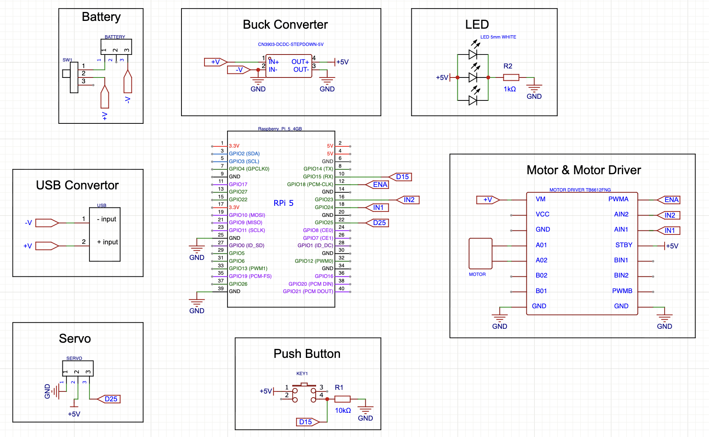

# WRO Future Engineers 2026 — Team Currents

## The Team

- **Darsh Makadia** — Adani International School
- **Ehan Mansuri** - Udgam School For Children
- **Coach:** Sunil Solanki

---

## Robot Overview

An autonomous robot using cameras for WRO 2026 Future Engineers. The robot uses a Raspberry Pi 5 as its sole computer which deals with the camera input, color recognition, distance calculation from walls, motor movement, and servos for turning, all within a single Python loop.

| View 1 (Robot from Top: Shows Differential) | View 2 (Robot from side with Servo Mount) |
|---|---|
|  |  |

---

## Mobility Management

**Drive:** Single Lego EV3 Medium Motor (rear-wheel drive)  
**Steering:** DS3225 servo (25kg/cm) for parallel steering  
**Chassis:** Lego Technic beams  

### Motor choice

Currently, we have only one EV3 Medium Motor connected to the rear axle. You can see the mechanical differential that is mounted on the chassis in our photos; however, this mechanism is already constructed with the intention to be connected to a second EV3 motor when required for improved traction or maneuverability, in case the single-motor operation is not enough.

### Why a mechanical differential at all

Even with one motor, routing power through the differential instead of a fixed axle lets the outer rear wheel spin faster than the inner wheel during a turn. Without this, a fixed axle forces both wheels to rotate at the same speed in a corner, which causes one wheel to scrub against the floor and creates unpredictable turning behaviour. The differential removes that problem and also makes adding a second motor later a simple mechanical change with no rewiring needed.

### The rule conflict we had to solve

Reading the rulebook carefully, rule 11.3 says the vehicle must have "one driving axle" but also allows four-wheel drive which was a contradiction. Rule 11.13 adds that two driving motors cannot be connected independently of each other.

Our proposed solution should we use the second motor: connect both motors to the **same output channel** of the TB6612FNG, so that they will be supplied with the same PWM signal, and won’t be controlled independently from each other. Then the differential will take care of the distribution of the power between the wheels mechanically. Thus, rules 11.13 and 11.3 are fulfilled.

### Steering

We looked into Ackermann steering, where the inner wheel steers at a greater angle compared to the outer wheel when the vehicle takes a corner, which is an ideal design used by actual cars that have reduced scrub and consistency of turning radius. With the help of the coach, we began with a parallel steering system (steering angles of both front wheels being equal) as an attempt for our complete functioning robot.

*Rear differential assembly*

---

## Power & Sense Management

**Compute:** Raspberry Pi 5 (4GB)  
**Camera:** Pi Camera Module 3 Wide  
**Motor driver:** TB6612FNG breakout

### Why camera and not LiDAR

We purchased a RPLidar C1 (360° laser scanner) and initially planned to use it for wall detection since it gives direct distance readings in every direction. We decided against it for two reasons:

1. A full 360° point cloud every scan is significant CPU load on top of camera processing, motor control, and servo control which all run in the same Pi loop. We were not confident the loop would stay fast enough under that combined load.
2. The Pi Camera Module 3 Wide covers everything we actually need: estimating wall distance left and right, reading the orange and blue lane lines, and detecting red and green pillars for the obstacle challenge. There was no sensing task that genuinely required LiDAR.

The RPLidar is not used this year. The catch is that camera-based distance estimation is indirect and angle-dependent. We solved this with the scan-row method described below.

### Electrical Power Distribution

| Component / Subsystem | Primary Power Source | Input Rail / Pins |
| :--- | :--- | :---: |
| **Raspberry Pi 5** | Battery via USB Converter | `- input` / `+ input` |
| **TB6612FNG (Motor Power)** | Battery (Raw) | `VM` / `GND` | 
| **DC Motor** | TB6612FNG Motor Driver | `A01` / `A02` |
| **DS3225 Steering Servo** | Buck Converter | `+5V` / `GND` | 
| **White LED Array** | Buck Converter | `+5V` / `GND` |
| **Push Button** | Buck Converter | `+5V` / `GND` |
| **TB6612FNG (Logic)** | Buck Converter | `STBY` |

Isolating the Pi from the motor rail means motor current spikes and PWM switching noise don't affect the Pi's supply voltage. A brownout mid-run would reset the program and lose all states and variable values.

### Circuit schematic

Designed in EasyEDA. The first version had long wires crossing the entire sheet and was hard to read or verify. We rebuilt it using **net labels** which are short named stubs on each component pin, with matching names on the destination pin so components sit cleanly in labelled boxes with no long wires. The layout now mirrors how professional schematics are structured, which also makes the ERC checker more useful since every unconnected pin is immediately obvious.

### GPIO pin map

| Pi Physical Pin | GPIO Pin | Net Label | Destination / Component |
| :---: | :---: | :---: | :--- |
| **10** | GPIO15 | `D15` | Push Button (Input) |
| **12** | GPIO18 | `ENA` | TB6612FNG `PWMA` (Motor PWM Speed) |
| **16** | GPIO23 | `IN2` | TB6612FNG `AIN2` (Motor Direction) |
| **18** | GPIO24 | `IN1` | TB6612FNG `AIN1` (Motor Direction) |
| **22** | GPIO25 | `D25` | DS3225 Servo (PWM Steering Signal) |
| **25,39**| *GND* | `GND` | Common System Ground |

---

## Obstacle Management

### Open Challenge algorithm

The robot runs as a three-state machine: `DETERMINE_DIRECTION → RACE → STOP`

**DETERMINE_DIRECTION**  
The robot moves slowly while scanning for orange or blue on the floor. The current implementation locks direction on the first frame a blob is detected. A known improvement of requiring several consecutive frames of the same color before locking is planned to prevent a single noisy frame (glare, shadow) from committing the wrong direction for the entire run.

**RACE**  
Every camera frame the robot:
1. Scans a single horizontal row near the bottom of the frame, outward from centre, to find where the black wall starts on each side
2. Calculates `error = left_distance - right_distance` and applies a proportional steering correction
3. Slows down proportionally to how sharp the correction is —> so small drifts get small adjustments, not sudden wheel yanks
4. If neither side wall is found near centre (only the front wall fills the frame) —> corner detected —> applies a fixed turn in the locked direction
5. Counts orange lines crossed with debounce at 12 lines (3 laps × 4 straights), moves to STOP

**STOP**  
Creep forward briefly to clear the finish line, then stop.

### Why a scan-row for wall distance, not total wall area

An earlier design compared total black pixel area in the left vs right half of the frame. This had a consistent problem: a wall nearly parallel to the camera direction fills many pixels even when it is not actually close (wide viewing angle = large area, even at distance). This made the robot steer incorrectly approaching corners.

The scan-row method of scanning one horizontal row and finding where black starts from the centre outward avoids this. It measures how much floor is visible between the centre and the wall edge, which is a more direct proxy for actual distance and is not affected by viewing angle in the same way.

### Color detection design

Color detection is written as **separate functions per color** like `get_green_mask()`, `get_red_mask()`, `get_orange_mask()`, `get_blue_mask()` instead of one combined function.

Reasons:
- Each color's HSV range is tuned and tested independently without touching anything else
- The open challenge only calls orange and blue and so no unnecessary computation on red/green present in every frame
- The obstacle challenge will only call red and green which is the same benefit in reverse
- When one color behaves unexpectedly under venue lighting, it is immediately obvious which function to fix
- Red detection specifically needs two HSV ranges (red wraps around hue 0 in HSV). Keeping it in its own function makes this logic self-contained and easier to follow

HSV ranges are set from the official WRO 2026 rulebook color specifications (section 13) with wide bounds, since real venue lighting rarely matches the spec. A white LED mounted next to the camera provides a consistent near-field light source so color temperature seen by the camera stays stable between practice and competition.

---

## What We Tried and Changed

**Schematic v1:** Long wires connecting every component across the full sheet which was hard to trace, hard to verify, hard to check with ERC. Rebuilt using net labels after studying how top WRO teams' schematics were structured.

**Direction detection:** Current code locks on the first frame a color blob is detected. Identified as a risk (one glare frame = wrong direction for the whole run). Debounce fix is planned which will require N consecutive frames of the same color before committing.

**Area-based wall detection:** Compared total black pixel area left vs. right. Caused incorrect steering near corners due to angle-dependent area. Replaced with single scan-row edge detection.

**Variable `area` bug in `get_largest_blob_coords`:** Current v1 code references `area` before calculating it, which causes a crash at runtime. We need to add `area = cv2.contourArea(largest_contour)` before the comparison. This will be corrected in v2.

**Duplicate imports in `open_challenge_v1.py`:** Imports are written twice at the top with slightly different module names. Will be cleaned up in v2.

---

## Code

| File | Purpose |
|---|---|
| `src/color_detection_v1.py` | HSV color ranges, individual mask functions per color, largest blob coordinate extraction |
| `src/open_challenge_v1.py` | Camera loop, direction detection, wall scan, steering, speed control, corner detection, line counting |

> v1 is the first working draft. Known bugs and planned improvements are documented above. v2 will address all flagged items found and improve algorithm.

---

## What's Next

- [ ] Fix `area` variable bug in `color_detection_v1.py`
- [ ] Clean up duplicate imports in `open_challenge_v1.py`
- [ ] Add debounce to direction detection
- [ ] Find proper HSV values according to the LED lighting present
- [ ] Wire GPIO stubs to real TB6612 and servo hardware
- [ ] Test wall-following on a real WRO track and tune `STEERING_GAIN` and `WALL_DARK_THRESHOLD`
- [ ] Test with second EV3 motor through differential if traction is insufficient
- [ ] Obstacle Challenge code
- [ ] Evaluate Ackermann steering upgrade
